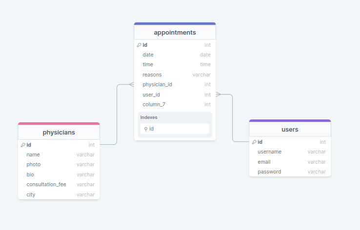

# Rails Budget App

> This a web app built on Rails API as backend and React framework as a frontend. This app is used for reserving a doctor's appointment by patients. Users can create, view, edit and delete a list of appointment(s).

## Live Demo Link

[Live Link](https://shielded-wave-72984.herokuapp.com/)


## Kanban Board

[Live Link](https://github.com/users/white3d/projects/2/views/1)


## API documentation

[Live Link](https://medium.com/@pazzomuk/doctors-appointments-api-documentation-2412e3e9eb3f)


## DB Graph
- 

doctor-appointment-db-graph

## Built With

- 
- 
- 
- 
- 
- 
- 

## Get Started

### Run

```
To get a clone of the project, run `git clone https://github.com/white3d/Rails-React-Doctor-Appointment-App.git`
```

```
cd /Rails-React-Doctor-Appointment-App
```
```
bundle install
```
```
rake db:create 
```

```
rake db:migrate 
```
```
rake db:seed 
```
```
cd /frontend` 
```
```
yarn install
```

```
npm install --force
```
```
cd ..
```
rake start
```


### Available Scripts

Gets all the required dependencies of the projects.


For more details, see [the Installation docs page](https://www.ruby-lang.org/en/).

## Authors

👤 **Edward Odhiambo**

- GitHub: [@whit3d](https://github.com/white3d)
- Twitter: [@odhiambo_ed](https://twitter.com/odhiambo_ed)
- LinkedIn: [Edward Odhiambo](https://www.linkedin.com/in/edward-odhiambo-6a462a21b/)
- Portfolio: [Edward Odhiambo](https://edwardodhiambo.com/)

**Terbeche Mostefa**

- GitHub: [@githubhandle](https://github.com/Terbeche)
- LinkedIn: [LinkedIn](https://www.linkedin.com/in/mustapha-terbeche/)

**Patrick MUKUNZI**

- GitHub: [@Patrick](https://github.com/Pazzo97)
- Twitter: [@Patrick](https://twitter.com/mukunzipat)
- LinkedIn: [@Patrick](https://www.linkedin.com/in/patrick-mukunzi/)


## 🤝 Contributing

Contributions, issues, and feature requests are welcome!!!

Feel free to check the [issues page](https://github.com/white3d/Rails-React-Doctor-Appointment-App/issues)

## Show your support

Give a ⭐️ if you like this project!

## Acknowledgments

- Hat tip to [Murat Korkmaz on Behance](https://www.behance.net/gallery/26425031/Vespa-Responsive-Redesign/modules/173005577) the original design owner.

## 📝 License

This project is [MIT](./LICENSE) licensed.
